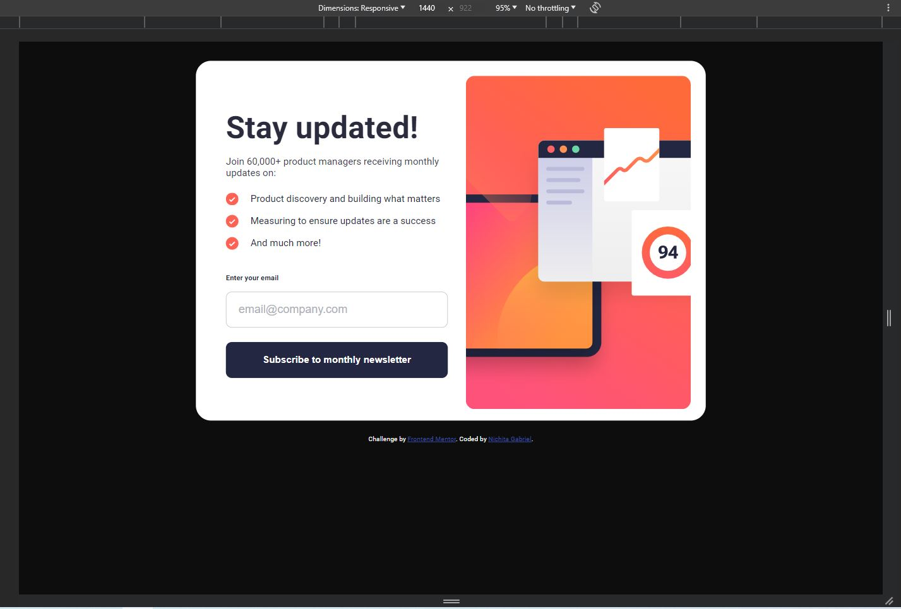
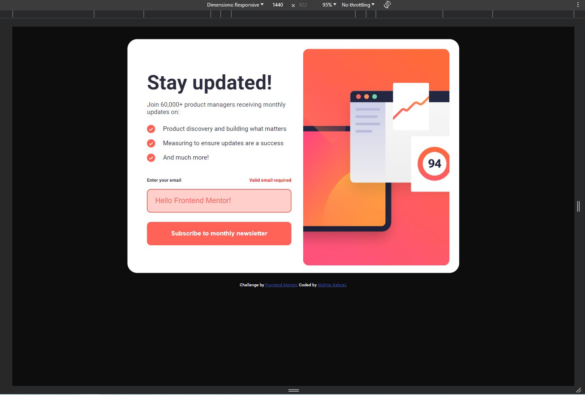
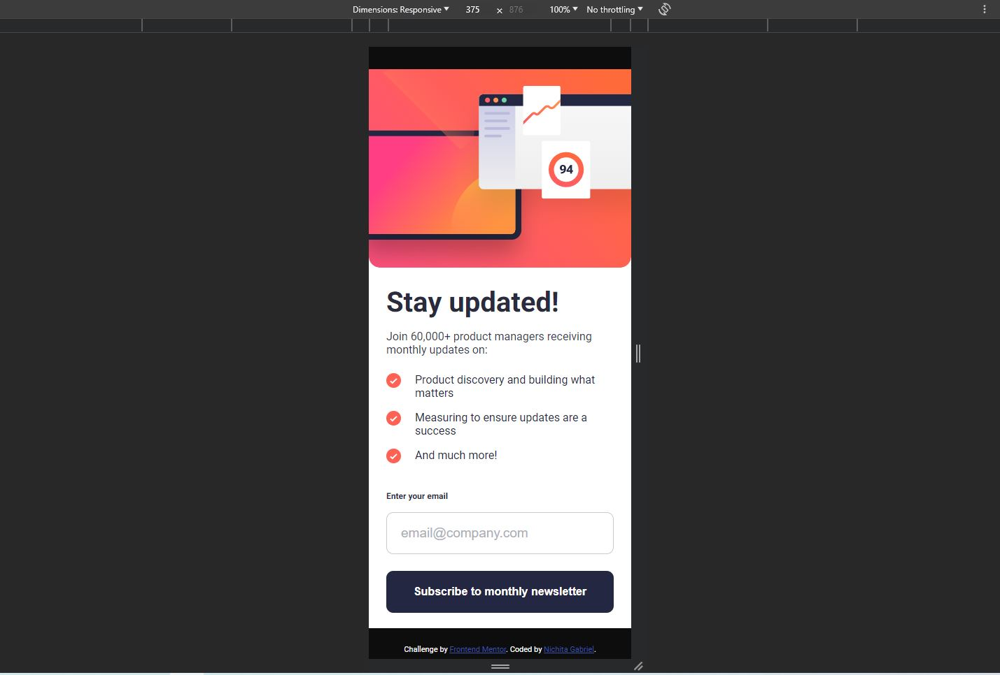
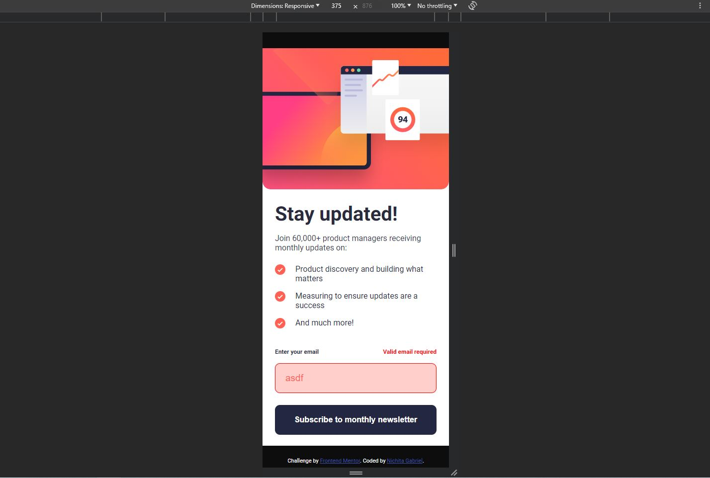

# Newsletter-sign-up-form-with-success-message
I had to build out a Newsletter sign-up form with success message and get it looking as close to the design as possible.

# Frontend Mentor - Newsletter sign-up form with success message solution

This is a solution to the [Newsletter sign-up form with success message challenge on Frontend Mentor](https://www.frontendmentor.io/challenges/newsletter-signup-form-with-success-message-3FC1AZbNrv). Frontend Mentor challenges help you improve your coding skills by building realistic projects. 

## Table of contents

- [Overview](#overview)
  - [The challenge](#the-challenge)
  - [Screenshot](#screenshot)
  - [Links](#links)
- [My process](#my-process)
  - [Built with](#built-with)
- [Author](#author)
- [Acknowledgments](#acknowledgments)

## Overview

### The challenge

Users should be able to:

- Add their email and submit the form
- See a success message with their email after successfully submitting the form
- See form validation messages if:
  - The field is left empty
  - The email address is not formatted correctly
- View the optimal layout for the interface depending on their device's screen size
- See hover and focus states for all interactive elements on the page

### Screenshot

Desktop version

Desktop invalid email version

Mobile version

Mobile invalid email version

### Links

- [Solution URL](https://github.com/NichitaGabriel/Newsletter-sign-up-form-with-success-message)
- [Live Site URL](https://nichitagabriel.github.io/Newsletter-sign-up-form-with-success-message/)

## My process

### Built with

- HTML5
- CSS
- Flexbox
- JavaScript
- Mobile-first workflow

## Author

- Website - [Nichita Gabriel](https://github.com/NichitaGabriel)
- Frontend Mentor - [@nichitagabriel](https://www.frontendmentor.io/profile/NichitaGabriel)

## Acknowledgments

[MaximilianoDanielGarcia](https://www.frontendmentor.io/profile/MaximilianoDanielGarcia) - "Big thanks for the fantastic CSS advice!